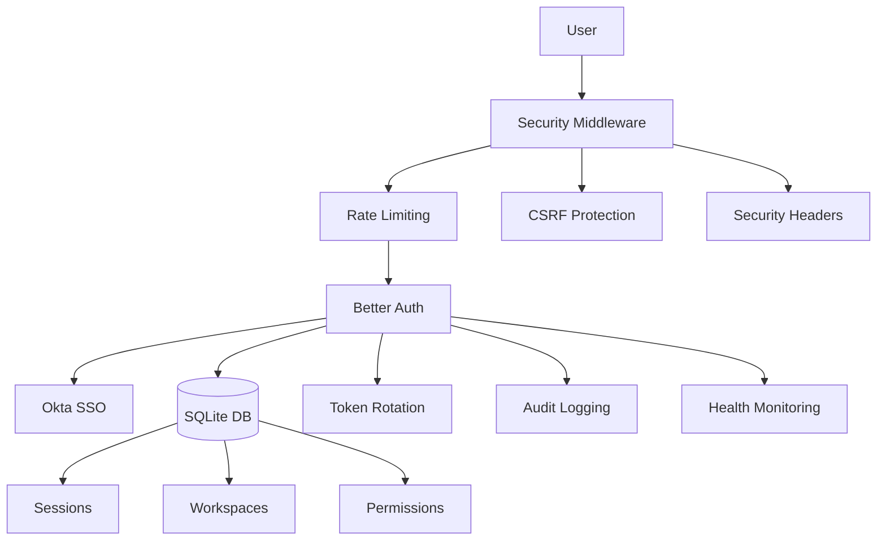
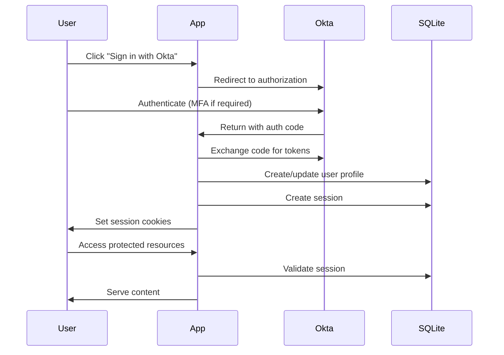

# 🔐 Hardened Okta SSO Implementation Guide

## Overview

This implementation provides enterprise-grade security for Okta SSO integration with SQLite session management, featuring comprehensive security controls, audit logging, and workspace management.

## 🏗️ Architecture



## 🚀 Quick Start

### 1. Environment Setup

Create `.env.local` from the example:
```bash
cp .env.example .env.local
```

Configure your Okta settings:
```env
OKTA_ISSUER="https://dev-xxxxx.okta.com"
OKTA_CLIENT_ID="your-client-id"
OKTA_CLIENT_SECRET="your-client-secret"
AUTH_SECRET="$(openssl rand -base64 32)"
```

### 2. Database Initialization

```bash
# Install dependencies
yarn install

# Initialize database with migrations
yarn db:init

# Run with reset flag if needed
yarn db:init --reset
```

### 3. Okta Configuration

In your Okta Admin Console:

1. **Create Application**:
   - Type: OIDC - Web Application
   - Grant type: Authorization Code
   - Sign-in redirect URIs: `http://localhost:3000/api/auth/sso/oidc/callback/okta`
   - Sign-out redirect URIs: `http://localhost:3000`

2. **Configure Groups**:
   - Create groups: `okta-admins`, `okta-managers`, `okta-developers`
   - Assign users to groups
   - Add groups claim to ID token

3. **API Access**:
   - Create API token for user provisioning
   - Enable group claims in tokens

### 4. Start Development

```bash
yarn dev
```

## 🛡️ Security Features

### 1. **Multi-Layer Authentication**
- Okta as primary IdP with MFA support
- Local session management in SQLite
- Automatic token rotation with family tracking
- Session freshness validation

### 2. **Rate Limiting**
```typescript
// Configured per endpoint
"/sign-in/*": 5 attempts per 5 minutes
"/api/auth/sso/*": 10 attempts per minute
"/api/auth/token": 20 refreshes per minute
```

### 3. **Security Headers**
- HSTS with preload
- CSP with strict policies
- X-Frame-Options: DENY
- X-Content-Type-Options: nosniff

### 4. **Token Security**
- Automatic rotation every 15 minutes
- Refresh token families for reuse detection
- Secure token storage with SHA-256 hashing
- Maximum 10 refreshes per family

### 5. **Workspace Isolation**
- Multi-tenant support
- Per-workspace user limits
- Domain-based access control
- Role-based permissions (RBAC)

### 6. **Audit Logging**
- All authentication events
- Failed login attempts
- Token operations
- Permission changes
- 90-day retention (configurable)

## 📊 Database Schema

### Core Models:
- **User**: Okta-synced user profiles
- **Session**: Active user sessions
- **Workspace**: Multi-tenant workspaces
- **SecurityPolicy**: Per-workspace security rules
- **AuditLog**: Comprehensive audit trail
- **RefreshToken/AccessToken**: Token management
- **RateLimit**: Rate limiting state

## 🔄 Authentication Flow



## 🎯 Role Mapping

Okta groups are automatically mapped to application roles:

| Okta Group | App Role | Permissions |
|------------|----------|-------------|
| okta-superadmins | superadmin | Full access |
| okta-admins | admin | Admin panel, user management |
| okta-managers | manager | Reports, workspace view |
| okta-developers | developer | API access, workspace view |
| Default | member | Basic access |

## 🔧 API Endpoints

### Health Check
```bash
GET /api/health
```

### SSO Sign-in
```typescript
await authClient.signIn.sso({
  providerId: "okta",
  callbackURL: "/dashboard"
});
```

### Token Refresh
```typescript
POST /api/auth/token/refresh
{
  "refreshToken": "..."
}
```

### Session Management
```typescript
// Get current session
const session = await authClient.getSession();

// Revoke specific session
await authClient.revokeSession({ token: "..." });

// Revoke all other sessions
await authClient.revokeOtherSessions();
```

## 📈 Monitoring

### Health Checks
- Database connectivity
- Okta availability
- Memory usage
- Security events
- Error rates

### Metrics Tracked
- Active users/sessions
- Request rates
- Error percentages
- Token rotation frequency
- Failed authentication attempts

### Alerts
- Critical security events
- High error rates
- Component failures
- Suspicious activity patterns

## 🚨 Security Best Practices

1. **Environment Variables**
   - Never commit `.env` files
   - Use strong AUTH_SECRET (32+ chars)
   - Rotate secrets regularly

2. **Database**
   - Regular backups (automated)
   - Encrypt sensitive fields
   - Use prepared statements

3. **Sessions**
   - Short access token lifetime (15 min)
   - Refresh token rotation
   - Session activity monitoring

4. **Monitoring**
   - Review audit logs regularly
   - Set up alerts for anomalies
   - Track failed login patterns

## 🧪 Testing

```bash
# Run database migrations
yarn db:migrate

# Test database connection
yarn db:test

# Run security checks
yarn security:audit

# Test Okta connection
yarn test:okta
```

## 🚀 Production Deployment

1. **Environment**:
   ```env
   NODE_ENV=production
   DATABASE_URL=file:/var/db/app.db
   ```

2. **Security Hardening**:
   - Enable all security headers
   - Configure firewall rules
   - Set up SSL/TLS
   - Enable rate limiting
   - Configure CORS properly

3. **Monitoring**:
   - Set up Sentry for error tracking
   - Configure Slack webhooks for alerts
   - Enable CloudWatch/Datadog metrics

4. **Backup Strategy**:
   - Automated daily backups
   - Off-site backup storage
   - Regular restore testing

## 📝 Maintenance

### Daily Tasks
- Review security alerts
- Check health endpoints
- Monitor error rates

### Weekly Tasks
- Review audit logs
- Check token rotation logs
- Validate backup integrity

### Monthly Tasks
- Update dependencies
- Rotate secrets
- Review access patterns
- Clean old audit logs

## 🆘 Troubleshooting

### Common Issues

1. **"Too Many Requests" Error**
   - Check rate limit configuration
   - Review client IP detection
   - Adjust limits if needed

2. **Session Expired**
   - Check session timeout settings
   - Verify token rotation
   - Review idle timeout

3. **Okta Connection Failed**
   - Verify OKTA_ISSUER URL
   - Check client credentials
   - Validate redirect URIs

4. **Database Locked**
   - Check concurrent connections
   - Review transaction handling
   - Consider connection pooling

## 📚 Additional Resources

- [Better Auth Documentation](https://better-auth.com)
- [Okta Developer Docs](https://developer.okta.com)
- [Prisma Documentation](https://www.prisma.io/docs)
- [OWASP Security Guidelines](https://owasp.org)

## 📄 License

This implementation follows security best practices and is suitable for production use with proper configuration and monitoring.